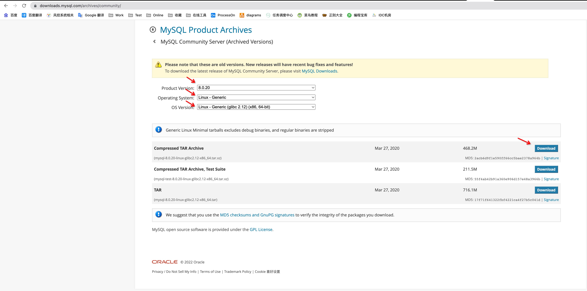
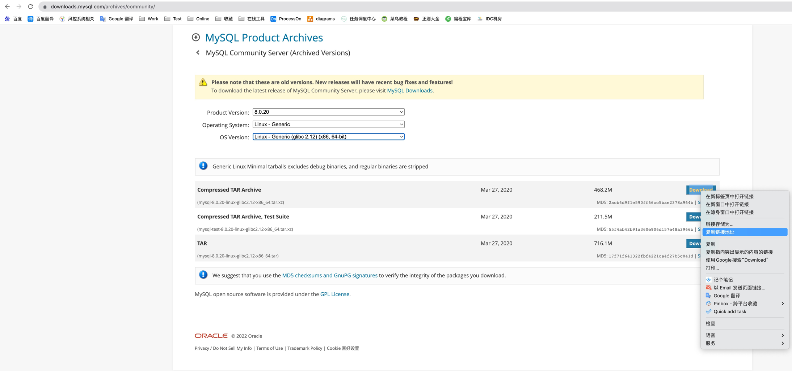
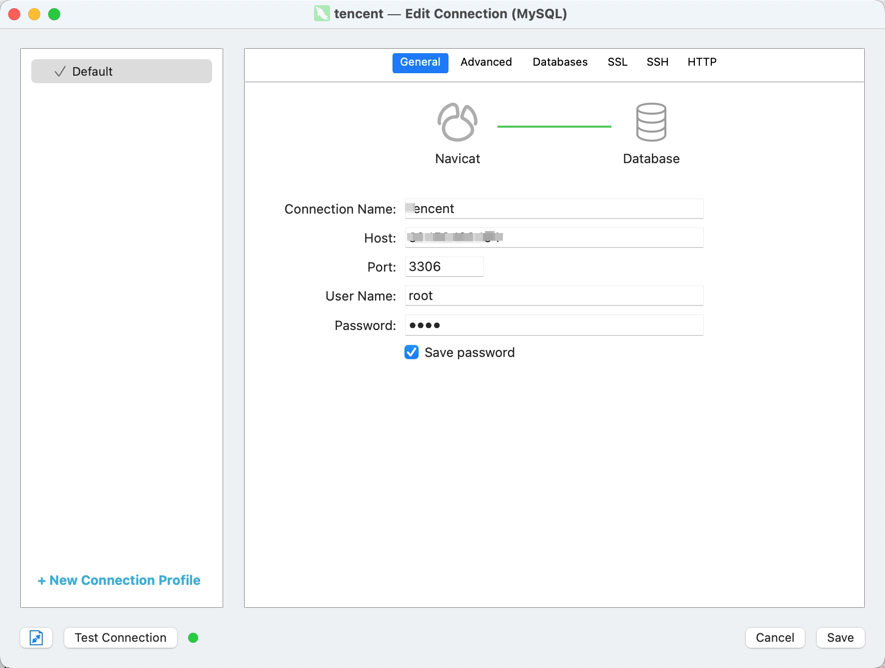
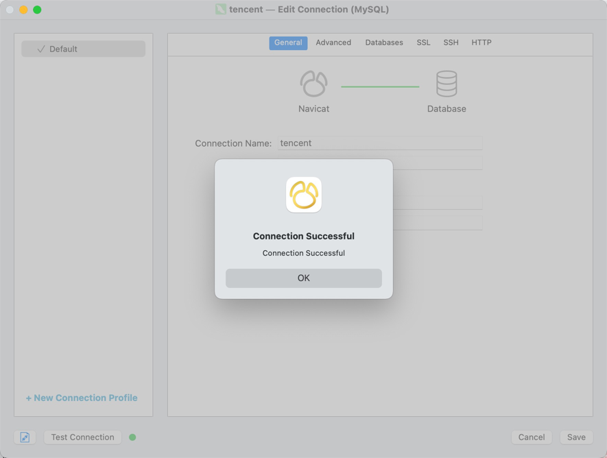

# Linux 之 MySQL单机版安装与配置

## 下载
官网：[https://downloads.mysql.com/archives/community/](https://downloads.mysql.com/archives/community/)

可以选择 wget 或 下载压缩包上传至服务器，这里我选择的版本是 mysql-8.0.20-linux-glibc2.12-x86_64.tar.xz

下载压缩包上传至服务器方式



wget 直接下载方式



```shell
wget https://downloads.mysql.com/archives/get/p/23/file/mysql-8.0.20-linux-glibc2.12-x86_64.tar.xz
```

解压缩
```shell
# 使用 xz -d xxx.tar.xz 再 tar -xvf xxx.tar

xz -d mysql-8.0.20-linux-glibc2.12-x86_64.tar.xz

tar -xvf mysql-8.0.20-linux-glibc2.12-x86_64.tar

# 或 直接

tar xvJf mysql-8.0.20-linux-glibc2.12-x86_64.tar.xz
```
mv 至 /usr/local 并改名为 mysql
```shell
mv mysql-8.0.20-linux-glibc2.12-x86_64 /usr/local/mysql
```
在 mysql 创建 data 目录
```shell
mkdir /usr/local/mysql/data
```
创建 mysql.imi 配置文件，位置：mysql安装目录，即 /usr/local/mysql
```imi
[client]
# 设置mysql客户端默认字符集
default-character-set = utf8

[mysqld]
# 设置3306端口
port = 3306
# 设置mysql的安装目录
basedir = /usr/local/mysql
# 设置 mysql数据库的数据的存放目录，MySQL 8+ 不需要配置，系统会自动在 $basedir 下生成 data 目录，否则有可能报错
# datadir = /usr/local/mysql/data
# 允许最大连接数
max_connections = 300
# 服务端使用的字符集默认为8比特编码的latin1字符集
character-set-server = utf8
# 创建新表时将使用的默认存储引擎
default-storage-engine = INNODB
```
初始化 mysql
```shell
/usr/local/mysql/bin/mysqld --initialize
```
初始化完成后，console 会输出 root 用户的初始默认密码，如
```shell
[root@VM-0-6-centos mysql]# /usr/local/mysql/bin/mysqld --initialize
2022-09-01T08:19:30.555748Z 0 [System] [MY-013169] [Server] /usr/local/mysql/bin/mysqld (mysqld 8.0.20) initializing of server in progress as process 12161
2022-09-01T08:19:30.562804Z 1 [System] [MY-013576] [InnoDB] InnoDB initialization has started.
2022-09-01T08:19:32.125239Z 1 [System] [MY-013577] [InnoDB] InnoDB initialization has ended.
2022-09-01T08:19:34.215863Z 6 [Note] [MY-010454] [Server] A temporary password is generated for root@localhost: uJhhgu&7jrgJ
```
uJhhgu&7jrgJ 就是初始密码，后续登录需要用到，你也可以在登陆后修改密码。

添加 mysql 服务到系统
```shell
cp -a /usr/local/mysqlsupport-files/mysql.server /etc/init.d/mysql
```
执行授权命令
```shell
chmod +x /etc/init.d/mysql

chkconfig --add mysql
```
启动 mysql
```shell
service mysql start

service mysql status
```
登录 mysql
```shell
mysql -uroot -p
```
修改 root 密码
```sql
ALTER USER 'root'@'localhost' IDENTIFIED WITH mysql_native_password BY 'root';

flush privileges;
```
修改远程连接
```sql
use mysql

UPDATE user SET host = '%' where user = 'root';

flush privileges;
```
Navicat 连接






