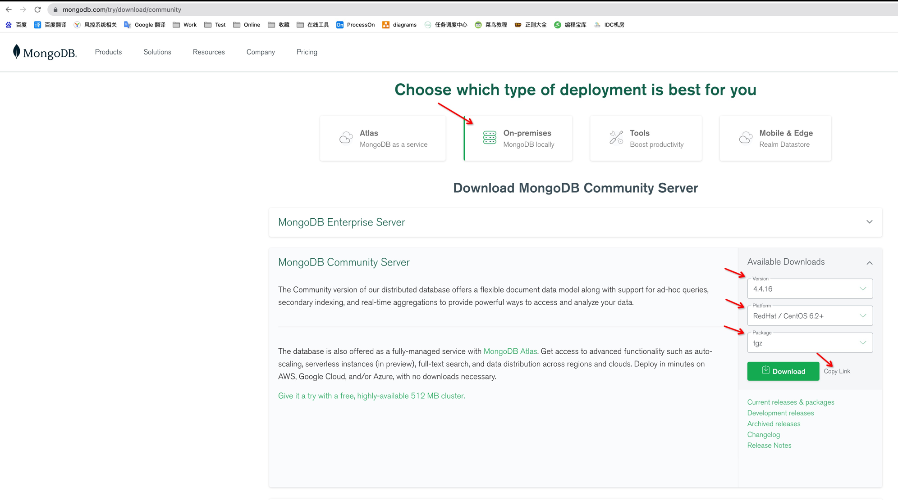
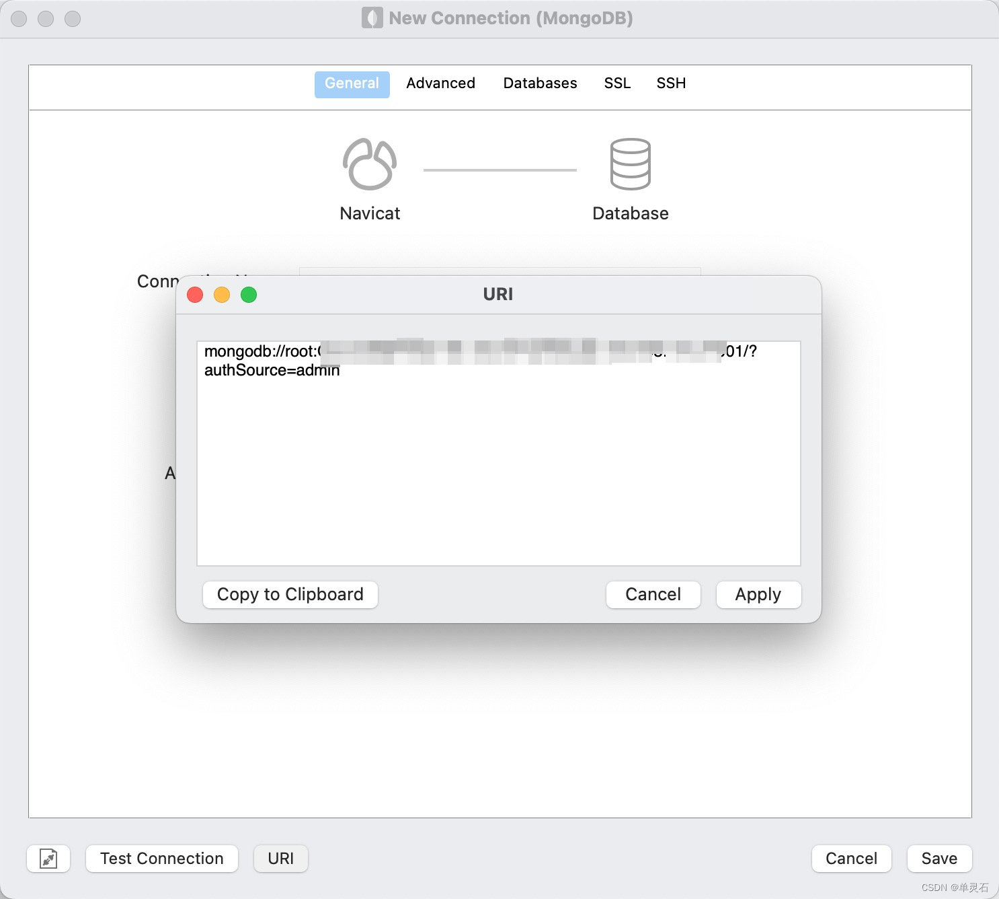

# Linux 之 MongoDB副本集安装与配置

## 环境准备
我这里准备了一台机器，直接按照端口来区分，有机器的可以在多台机器部署

## 下载
官网：[https://www.mongodb.com/try/download](https://www.mongodb.com/try/download)

可以选择 wget 或 下载压缩包上传至服务器，这里我选择的版本是 mongodb-linux-x86_64-rhel62-4.4.16.tgz

#### wget下载

```shell
wget https://fastdl.mongodb.org/linux/mongodb-linux-x86_64-rhel62-4.4.16.tgz
```

## 安装
安装前先创建目录，创建 /usr/local/mongodb
```shell
mkdir -p /usr/local/mongodb
```
解压缩
```shell
tar -zxvf mongodb-linux-x86_64-rhel62-4.4.16.tgz
```
cp 至 /usr/local/mongodb 并改名为 mongodb0 和 mongodb1
```shell
cp mongodb-linux-x86_64-rhel62-4.4.16 /usr/local/mongodb/mongodb0

cp mongodb-linux-x86_64-rhel62-4.4.16 /usr/local/mongodb/mongodb1
```
在 mongodb0 和 mongodb1 下分别创建 data、log、conf
```shell
mkdir /usr/local/mongodb/mongodb0/data /usr/local/mongodb/mongodb0/log /usr/local/mongodb/mongodb0/conf

mkdir /usr/local/mongodb/mongodb1/data /usr/local/mongodb/mongodb1/log /usr/local/mongodb/mongodb1/conf
```
创建 mongodb0 配置文件 mongodb.conf，mongodb1 把所有路径和 port 改掉就行

文件：[mongodb.conf](../../conf/mongo/mongodb.conf)
```yaml
# 系统日志相关配置
systemLog:
  # 指定一个文件
  destination: file
  # 日志输出文件路径
  path: /usr/local/mongodb/mongodb0/log/mongod.log
  # 日志以追加模式记录
  logAppend: true
#  数据存储相关的配置
storage:
  # 数据存放路径
  dbPath: /usr/local/mongodb/mongodb0/data
  # 指定存储每个数据库文件到单独的数据目录。如果在一个已存在的系统使用该选项，需要事先把存在的数据文件移动到目录。
  directoryPerDB: true
  # 是否开启 redo 日志
  journal:
    enabled: true
# 进程控制相关配置
processManagement:
  # 后台守护进程
  fork: true
  # pid文件的位置, 未指定则自动生成到 data 中
  pidFilePath: /usr/local/mongodb/mongodb0/log/mongod.pid
# 网络相关配置
net:
  # 端口号, 不配置默认为 27017
  port: 27000
  # 监听地址, 如果不配置这行是监听在 0.0.0.0
  bindIp: 0.0.0.0
# 复制集相关配置
replication:
  # 指定副本集的名称
  replSetName: rs
```
启动 mongodb0 和 mongodb1
```shell
/usr/local/mongodb/mongodb0/bin/mongod --config /usr/local/mongodb/mongodb0/conf/mongodb.conf

/usr/local/mongodb/mongodb1/bin/mongod --config /usr/local/mongodb/mongodb1/conf/mongodb.conf
```
登录 mongo
```shell
/usr/local/mongodb/mongodb0/bin/mongo -port 27000
```
设置副本集
```javascript
rs.initiate({
     _id : "rs",
     members : [
         {_id : 0, host : "82.156.193.194:27000"},
         {_id : 1, host : "82.156.193.194:27001"}
     ]
});
```
查看副本集：  
```javascript
rs.status();
```
先进入 admin 数据库，创建 root 用户
```shell
use admin
db.createUser({user: 'root',pwd: 'root',roles:[{role: 'root', db: 'admin'}]});
db.auth("root","root");
```
修改用户密码
```shell
use admin
db.changeUserPassword("root","root123");
db.auth("root","root123");
```
Navicat 连接
```shell
mongodb://root:root@[host]:27000,[host]:27001/?authSource=admin
```



