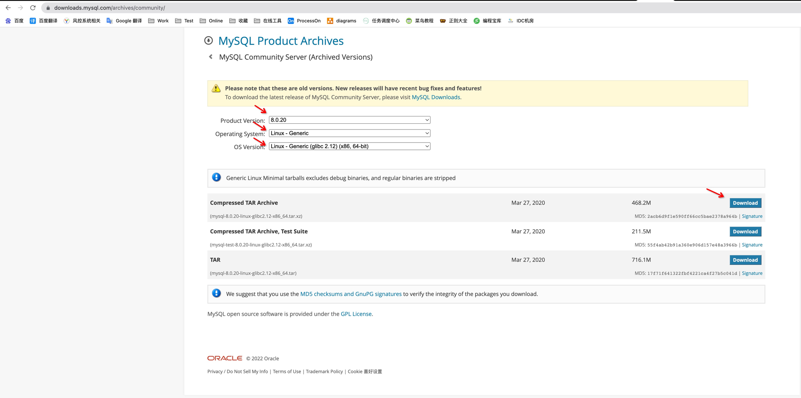
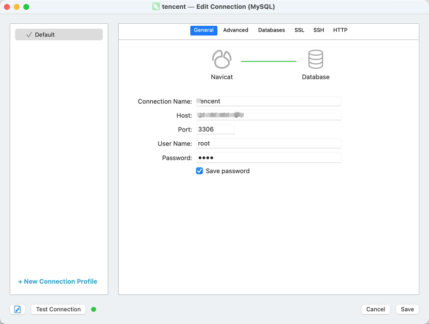
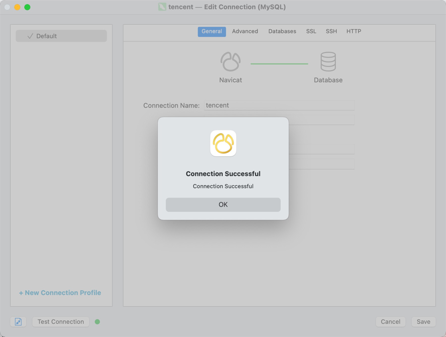

# Linux 之 MySQL安装与配置

## 下载
官网：[https://downloads.mysql.com/archives/community/](https://downloads.mysql.com/archives/community/)

可以选择 wget 或 下载压缩包上传至服务器，这里我选择的版本是 mysql-8.0.20-linux-glibc2.12-x86_64.tar.xz

下载压缩包上传至服务器方式



wget 直接下载方式


```shell
wget https://downloads.mysql.com/archives/get/p/23/file/mysql-8.0.20-linux-glibc2.12-x86_64.tar.xz
```

---

解压缩
```shell
tar -xvf mysql-8.0.20-linux-glibc2.12-x86_64.tar.xz
```

mv 至 /usr/local 并改名为 mysql
```shell
mv mysql-8.0.20-linux-glibc2.12-x86_64 /usr/local/mysql
```

---

先配置 MYSQL_HOME 环境变量，便于后续操作 mysql，编辑 .bash_profile 文件，该文件在 ~ 下，没有则创建
```shell
vim ~/.bash_profile
```

添加环境变量如下
```shell
export MYSQL_HOME=/usr/local/mysql
PATH=$PATH:$MYSQL_HOME/bin

export PATH
```

刷新环境变量
```shell
[root@VM-0-6-centos tmp] source ~/.bash_profile
```

---

查看 mysql 配置文件的读取顺序
```shell
mysql --help | grep my.cnf
```

order of preference, my.cnf, $MYSQL_TCP_PORT,

/etc/my.cnf /etc/mysql/my.cnf /usr/local/mysql/etc/my.cnf ~/.my.cnf

---

以上配置文件位置都可使用，我选择使用 /usr/local/mysql/etc/my.cnf，在 mysql 创建 etc 目录
```shell
mkdir /usr/local/mysql/etc
```

创建 my.cnf 配置文件，内容如下，位置：/usr/local/mysql/etc

文件：[my.cnf](../../conf/mysql/my.cnf)
```ini
[mysqld]
# 设置3306端口
port = 3306
# 设置mysql的安装目录
basedir = /usr/local/mysql
socket = /usr/local/mysql/mysql.sock
# 设置 mysql数据库的数据的存放目录，MySQL 8+ 不需要配置，系统会自动在 $basedir 下生成 data 目录，否则有可能报错
# datadir = /usr/local/mysql/data
# 允许最大连接数
max_connections = 100
# 服务端使用的字符集默认为8比特编码的latin1字符集
character-set-server = utf8mb4
# 创建新表时将使用的默认存储引擎
default-storage-engine = INNODB

[mysqld_safe]
log-error = /usr/local/mysql/data/err.log
pid-file = /usr/local/mysql/data/mysql.pid

[client]
socket = /usr/local/mysql/mysql.sock
# 设置mysql客户端默认字符集
default-character-set = utf8mb4
```

---

添加 mysql 用户组 并 创建 mysql 用户
```shell
groupadd mysql

useradd -r -g mysql mysql
```

赋予 mysql 用户 /usr/local/mysql 权限
```shell
chown -R mysql:mysql /usr/local/mysql
```

---

初始化 mysql，初始化完成后，console 会输出 root 用户的初始默认密码，如
```shell
mysqld --initialize --user=mysql
```
+aUmDEas8%.% 就是初始密码，后续登录需要用到，你也可以在登陆后修改密码。

---

添加 mysql 服务到系统
```shell
cp -a /usr/local/mysql/support-files/mysql.server /etc/init.d/mysql
```

---

执行授权命令
```shell
chmod +x /etc/init.d/mysql

chkconfig --add mysql
```

---

启动 mysql
```shell
service mysql start
```
Starting MySQL.Logging to '/usr/local/mysql/data/err.log'.

. SUCCESS!

---

查看 mysql 运行状态
```shell
service mysql status
```
SUCCESS! MySQL running (21047)

---

登录 mysql，Enter password: 输入刚刚的初始密码 +aUmDEas8%.%，输入不可见，无需理会
```shell
mysql -uroot -p
```
Enter password:

Welcome to the MySQL monitor.  Commands end with ; or \g.

Your MySQL connection id is 8

Server version: 8.0.20

Copyright (c) 2000, 2020, Oracle and/or its affiliates. All rights reserved.

Oracle is a registered trademark of Oracle Corporation and/or its

affiliates. Other names may be trademarks of their respective

owners.

Type 'help;' or '\h' for help. Type '\c' to clear the current input statement.

mysql>

---

修改 root 密码
```sql
ALTER USER 'root'@'localhost' IDENTIFIED WITH mysql_native_password BY 'root';
```
Query OK, 0 rows affected (0.01 sec)

---

修改远程连接
```sql
use mysql
UPDATE user SET host = '%' where user = 'root';
```
Query OK, 1 row affected (0.00 sec)

Rows matched: 1  Changed: 1  Warnings: 0

---

重新加载权限表，更新权限
```sql
flush privileges;
```
Query OK, 0 rows affected (0.00 sec)

---

Navicat 连接






