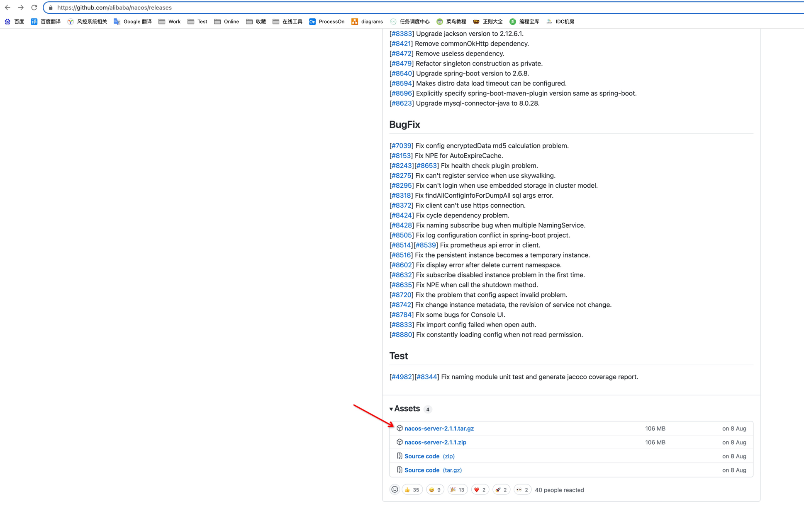
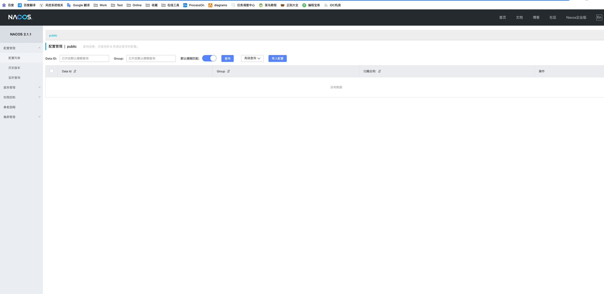

# Linux 之 Nacos安装与配置

## 下载
github：[https://github.com/alibaba/nacos/releases](https://github.com/alibaba/nacos/releases)

下载压缩包上传至服务器，这里我选择的版本是 nacos-server-2.1.1.tar.gz

下载压缩包



解压缩
```shell
[root@VM-0-6-centos tmp] tar -xvf nacos-server-2.1.1.tar.gz
```

mv 至 /home/worker/base 并改名为 nacos
```shell
[root@VM-0-6-centos tmp] mv nacos /home/worker/base/nacos
```

进入 /home/worker/base/nacos/conf 修改 application.properties 修改一下内容
```properties
#*************** Config Module Related Configurations ***************#
### If use MySQL as datasource:
spring.datasource.platform=mysql

### Count of DB:
db.num=1

### Connect URL of DB:
db.url.0=jdbc:mysql://82.156.193.194:3306/nacos?characterEncoding=utf8&connectTimeout=1000&socketTimeout=3000&autoReconnect=true&useUnicode=true&useSSL=false&serverTimezone=UTC
db.user.0=root
db.password.0=root
```

进入 /home/worker/base/nacos/bin 执行 startup.sh -m 指定启动模式，我们这里是单机模式 standalone
```shell
sh startup.sh -m standalone
```

以上配置文件位置都可使用，我选择使用 /usr/local/mysql/etc/my.cnf，在 mysql 创建 etc 目录
```shell
[root@VM-0-6-centos tmp] mkdir /usr/local/mysql/etc
```

访问 http://ip:8848/nacos/




